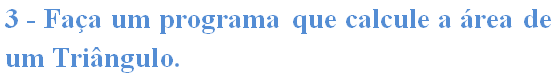
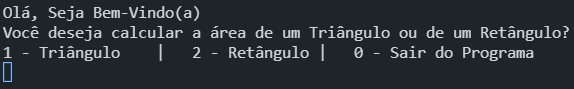
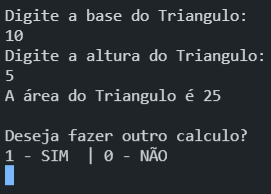

# Calculo de Áreas

## Objetivo do Projeto

</img>

## Linguagens Utilizadas

<ul>
<li>C#</li>
</ul>

## Programa em Execução

Exemplo 1

</img>

Exemplo 2

</img>

### Obs:

 Decidi adicionar a opção de calcular a área de um Retângulo 

